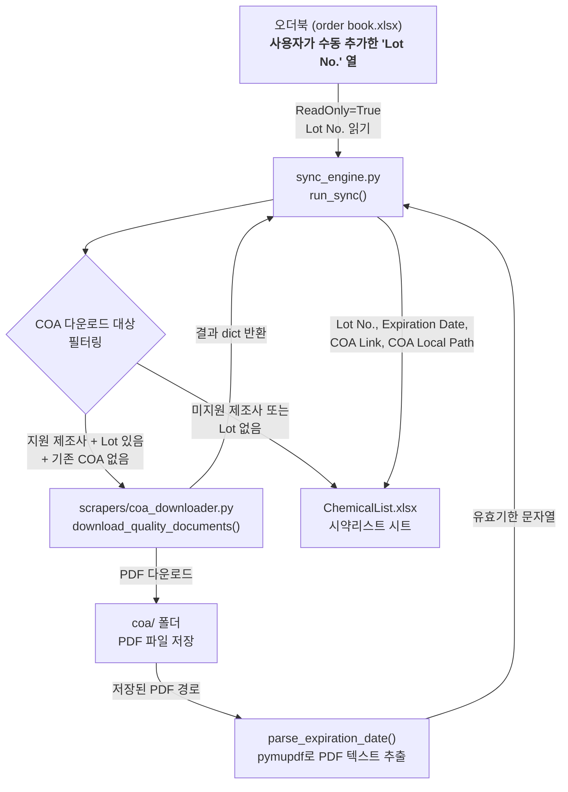

# COA Downloader 통합 구현 계획 (검토 수정본 — 코딩 승인 전)

> [!CAUTION]
> 이 문서는 구현 전 설계 검토만 완료한 상태다. 사용자의 별도 코딩 지시 전에는 Python, JSON, Excel 파일을 수정하지 않는다.
>
> 아래 **7. 상세 검토 결과 및 필수 수정 설계**가 앞부분의 기존 코드 개요와 충돌하면 7장의 내용이 우선한다. 특히 기존 삽입 A/C 예시는 그대로 구현하지 않는다.

## 목차
1. [전체 아키텍처](#1-전체-아키텍처)
2. [확정된 설계 결정 사항](#2-확정된-설계-결정-사항)
3. [파일별 변경 상세](#3-파일별-변경-상세)
4. [Expiration Date 파싱 로직 상세 설계](#4-expiration-date-파싱-로직-상세-설계)
5. [잠재적 버그 시나리오 및 방어 대책](#5-잠재적-버그-시나리오-및-방어-대책)
6. [검증 계획](#6-검증-계획)
7. [상세 검토 결과 및 필수 수정 설계](#7-상세-검토-결과-및-필수-수정-설계)

---

## 1. 전체 아키텍처

### 데이터 흐름



### 실행 순서 (sync_engine.py 내부)

```
1. 오더북 읽기 (ReadOnly=True)
2. 시약리스트 작업 복사본 열기
3. [기존] 네트워크 페이즈: DB 크롤링 (crawl_requests)
4. [신규] 네트워크 페이즈: COA 다운로드 (coa_download_requests)
5. [기존] Excel 기록 페이즈: 행 매핑 + DB 기록
6. [신규] Excel 기록 페이즈: COA 결과 기록 (Lot No., Expiration Date, COA Link, COA Local Path)
7. 서식/유효성검사 주입
8. 3-Way Merge Commit
```

> [!IMPORTANT]
> 핵심 제약: `coa_portable_package/coa_downloader.py`와 `scrapers/coa_downloader.py`는 **절대 수정하지 않는다.**

---

## 2. 확정된 설계 결정 사항

| # | 질문 | 결정 |
|---|---|---|
| Q1 | 오더북 "Lot No." 열 | 사용자가 수동 추가. 프로그램은 오더북에서 읽기만 함 |
| Q2 | Expiration Date 출처 | COA PDF 본문에서 파싱 (pymupdf 활용) |
| Q3 | COA 저장 위치 | `{오더북 폴더}/coa/` 별도 폴더 생성 |
| Q4 | 미지원 제조사 처리 | COA 관련 4개 열 모두 `"-"` 기록 |
| Q5 | 재다운로드 방지 | 기존 COA Local Path에 유효한 파일이 있으면 다운로드 건너뜀 |

---

## 3. 파일별 변경 상세

### 3-1. `config_manager.py` — DEFAULT_CONFIG 수정

> 파일: [`config_manager.py`](file:///c:/Users/Jeonghun Lee/.gemini/antigravity/scratch/chemical manager/chem_manager_app/core/config_manager.py)

#### 변경 ①: `source_headers` 리스트에 `"Lot No."` 추가 (L18~L21)

현재:
```python
"source_headers": [
    "번호", "날짜", "주문자", "회사", "품목명", 
    "수령확인", "CAS 번호", "품번", "용량", "수량", "보관온도"
],
```

변경 후:
```python
"source_headers": [
    "번호", "날짜", "주문자", "회사", "품목명", 
    "수령확인", "CAS 번호", "품번", "용량", "수량", "보관온도",
    "Lot No."
],
```

#### 변경 ②: `target_headers` 리스트에 4개 열 추가 (L22~L26)

현재:
```python
"target_headers": [
    "Order No.", "Order Date", "Ordered By", "Product Name", 
    "Manufacturer", "Package Size", "CAS No.", "Catalog No.", 
    "Room", "Storage Temp.", "Cabinet", "Quantity", "Used", "Status", "Remarks"
],
```

변경 후:
```python
"target_headers": [
    "Order No.", "Order Date", "Ordered By", "Product Name", 
    "Manufacturer", "Package Size", "CAS No.", "Catalog No.", 
    "Room", "Storage Temp.", "Cabinet", "Quantity", "Used", "Status", "Remarks",
    "Lot No.", "Expiration Date", "COA Link", "COA Local Path"
],
```

#### 변경 ③: `mapping` 딕셔너리에 `"Lot No."` 추가 (L27~L43)

`mapping` 딕셔너리 내부에 추가:
```python
"Lot No.": "Lot No."
```

> [!NOTE]
> `"Expiration Date"`, `"COA Link"`, `"COA Local Path"`는 오더북에서 직접 복사하는 열이 아니라 프로그램이 생성하는 열이므로 mapping에 넣지 않는다. mapping에 빈 문자열(`""`)로 추가하면 기존 매핑 루프(L594, L624)에서 `if not s_header: continue`로 자동 건너뛴다. 따라서 매핑에 추가하지 않아도 안전하다.

---

### 3-2. `config.json` — 실 사용 설정 파일 수정

> 파일: [`config.json`](file:///c:/Users/Jeonghun Lee/.gemini/antigravity/scratch/chemical manager/chem_manager_app/config.json)

#### 변경 ①: `source_headers` 배열에 `"Lot No."` 추가 (L5~L16)

L15 `"수량"` 뒤에 `"Lot No."` 추가:
```json
"source_headers": [
    "번호", "날짜", "주문자", "회사", "품목명", 
    "수령확인", "CAS 번호", "품번", "용량", "수량", "Lot No."
],
```

> [!WARNING]
> 현재 config.json의 `source_headers`에는 `"보관온도"`가 없다 (DEFAULT_CONFIG에만 있음). 실제 오더북 시트에 `"보관온도"` 열이 있는지 확인 필요. 없다면 현재 상태 유지하고 `"Lot No."`만 추가.

#### 변경 ②: `target_headers` 배열에 4개 열 추가 (L17~L33)

L32 `"Remarks"` 뒤에 추가:
```json
"target_headers": [
    "Order No.", "Order Date", "Ordered By", "Product Name",
    "Manufacturer", "Package Size", "CAS No.", "Catalog No.",
    "Room", "Storage Temp.", "Cabinet", "Quantity", "Used", "Status", "Remarks",
    "Lot No.", "Expiration Date", "COA Link", "COA Local Path"
],
```

#### 변경 ③: `mapping` 객체에 `"Lot No."` 추가 (L34~L49)

L49 `"Remarks": ""` 뒤에 추가:
```json
"mapping": {
    ...기존 유지...
    "Remarks": "",
    "Lot No.": "Lot No."
}
```

---

### 3-3. `sync_engine.py` — COA 다운로드 통합 (핵심)

> 파일: [`sync_engine.py`](file:///c:/Users/Jeonghun Lee/.gemini/antigravity/scratch/chemical manager/chem_manager_app/core/sync_engine.py)

총 3개 구간에 코드를 삽입한다.

---

#### 삽입 A: COA 다운로드 대상 수집 + 실행 (L551 직후, Excel 기록 페이즈 시작 전)

**위치**: 기존 크롤링 결과 로그 출력(L542~L551) 직후, Excel write phase 주석(L553) 직전.

**삽입 코드 개요**:

```python
# ===== [COA] 다운로드 대상 수집 =====
src_lot_name = mapping.get("Lot No.", "Lot No.")  # 오더북의 Lot No. 열 이름
src_lot_col = src_col_map.get(src_lot_name, 0)    # 오더북에서 Lot No. 열 위치

tgt_coa_link_col = tgt_col_map.get("COA Link", 0)
tgt_coa_path_col = tgt_col_map.get("COA Local Path", 0)
tgt_lot_col = tgt_col_map.get("Lot No.", 0)

coa_output_dir = os.path.join(src_folder, "coa")

# COA 다운로드 대상 dict: order_num_str → (vendor, catalog, lot) 또는 None(미지원)
coa_download_requests = {}

if src_lot_col > 0:
    for row_data in src_data:
        if not row_data:
            continue
        # 수령확인이 "O"/"ㅇ"인 행만
        if receipt_src_col == 0:
            continue
        receipt_val = row_data[receipt_src_col - 1]
        if str(receipt_val).strip().upper() not in {"O", "ㅇ"}:
            continue
        
        order_num_val = row_data[src_order_num_col - 1] if src_order_num_col - 1 < len(row_data) else None
        order_num_str = str(order_num_val).strip() if order_num_val else ""
        if not order_num_str or order_num_str == "None":
            continue
        
        # Lot No. 읽기
        lot_val = ""
        if src_lot_col - 1 < len(row_data):
            raw_lot = row_data[src_lot_col - 1]
            lot_val = str(raw_lot).strip() if raw_lot not in (None,) else ""
            # 숫자로 읽힌 경우 ".0" 제거
            if lot_val.endswith(".0") and lot_val[:-2].isdigit():
                lot_val = lot_val[:-2]
            if lot_val in ("None", "nan", ""):
                lot_val = ""
        
        if not lot_val:
            continue  # Lot No. 없으면 COA 다운로드 불가
        
        # Manufacturer 읽기
        vendor_val = ""
        if src_mfr_col and src_mfr_col - 1 < len(row_data):
            vendor_val = DBManager.normalize_manufacturer(row_data[src_mfr_col - 1])
        
        # Catalog No. 읽기
        catalog_val = ""
        if src_cat_col and src_cat_col - 1 < len(row_data):
            catalog_val = str(row_data[src_cat_col - 1] or "").strip()
            if catalog_val.endswith(".0"):
                catalog_val = catalog_val[:-2]
        
        if not vendor_val or not catalog_val:
            continue
        
        # 이미 시약리스트에 COA Local Path가 존재하면 건너뛰기
        if order_num_str in tgt_dict and tgt_coa_path_col > 0:
            existing_path = str(
                tgt_ws.Cells(tgt_dict[order_num_str], tgt_coa_path_col).Value or ""
            ).strip()
            if existing_path and existing_path not in ("-", "", "None", "nan"):
                if os.path.exists(existing_path) and os.path.getsize(existing_path) > 0:
                    continue  # 기존 COA 파일이 유효 → 건너뜀
        
        # coa_downloader.py가 지원하는 제조사인지 확인
        import re as _re
        vendor_key = _re.sub(r"[^a-z]", "", vendor_val.casefold())
        supported = vendor_key in {
            "tci", "aldrich", "sigmaaldrich", "sigma",
            "thermofisher", "thermo", "abcam"
        }
        
        if not supported:
            # 미지원 제조사 → 결과를 즉시 "unsupported"로 기록
            coa_download_requests[order_num_str] = None  # None = 미지원
            continue
        
        coa_download_requests[order_num_str] = (vendor_val, catalog_val, lot_val)
```

```python
# ===== [COA] 다운로드 실행 =====
coa_results = {}  # order_num_str → dict (download_quality_documents 반환값 또는 에러)

actual_coa_targets = {
    k: v for k, v in coa_download_requests.items() if v is not None
}

if actual_coa_targets:
    self.log(f"COA 다운로드 대상 {len(actual_coa_targets)}건 처리 중...")
    
    # SeleniumBase 컨텍스트 재사용
    if not hasattr(self, 'sb_context_manager') or not self.sb_context_manager:
        from seleniumbase import SB
        self.sb_context_manager = SB(
            uc=True, headless=self.config.get("headless", True)
        )
        self.sb = self.sb_context_manager.__enter__()
    
    from scrapers.coa_downloader import (
        download_quality_documents,
        QualityDocumentError,
    )
    
    for order_num, (vendor, catalog, lot) in actual_coa_targets.items():
        if self.is_stopped():
            raise Exception("사용자 요청으로 동기화가 중단되었습니다.")
        
        self.log(f"  COA 다운로드: {vendor} {catalog} (Lot: {lot})")
        try:
            result = download_quality_documents(
                context=self.sb,
                vendor=vendor,
                catalog=catalog,
                lot=lot,
                output_dir=coa_output_dir,
            )
            coa_results[order_num] = result
        except QualityDocumentError as exc:
            self.log(f"  COA 다운로드 실패 [{vendor} {catalog} Lot:{lot}]: {exc}")
            coa_results[order_num] = {"status": "error", "error": str(exc)}
        except Exception as exc:
            self.log(f"  COA 다운로드 오류 [{vendor} {catalog} Lot:{lot}]: {exc}")
            coa_results[order_num] = {"status": "error", "error": str(exc)}
    
    self.log(
        f"COA 다운로드 완료: 성공 "
        f"{sum(1 for r in coa_results.values() if r.get('status') in ('downloaded','fallback'))}건 / "
        f"실패 {sum(1 for r in coa_results.values() if r.get('status') == 'error')}건"
    )
```

---

#### 삽입 B: Expiration Date 파싱 헬퍼 함수 (L57 부근, run_sync 외부)

**위치**: `SyncEngine` 클래스 외부, `check_and_wait_lock` 함수(L30~L56) 직후, `class SyncEngine` 정의(L58) 직전에 독립 헬퍼 함수로 추가.

**삽입 코드 개요**:

```python
def _parse_expiration_date(pdf_path: str) -> str:
    """COA PDF 본문에서 유효기한(Expiration Date)을 추출한다.
    
    지원하는 표현:
      - Expiration Date / Expiry Date / Exp. Date / Exp Date
      - Retest Date / Re-test Date / Reanalysis Date
      - Valid Until / Valid Through / Valid To
      - Use Before / Use By / Best Before
      - Shelf Life (기간 표기만 반환)
    
    날짜 형식:
      - YYYY-MM-DD, YYYY/MM/DD, YYYY.MM.DD
      - DD-Mon-YYYY, DD Mon YYYY (예: 15-Aug-2028, 15 Aug 2028)
      - Mon DD, YYYY (예: Aug 15, 2028)
      - MM/DD/YYYY, DD/MM/YYYY (미국/유럽 구분은 월>12로 판단)
    
    Returns:
        파싱된 날짜 문자열 (YYYY-MM-DD 형식) 또는 빈 문자열
    """
    if not pdf_path or not os.path.exists(pdf_path):
        return ""
    
    try:
        import pymupdf
        doc = pymupdf.open(pdf_path)
        text = "\n".join(page.get_text() for page in doc)
        doc.close()
    except Exception:
        return ""
    
    import re
    from datetime import datetime
    
    # 유효기한 관련 키워드 패턴 (우선순위순)
    keywords = [
        r"expir(?:ation|y)[\s._]*date",
        r"exp\.?\s*date",
        r"re[\-\s]?test[\s._]*date",
        r"re[\-\s]?analysis[\s._]*date",
        r"valid\s+(?:until|through|thru|to)",
        r"use\s+(?:before|by)",
        r"best\s+before",
    ]
    
    # 월 이름 패턴
    month_names = (
        r"(?:Jan(?:uary)?|Feb(?:ruary)?|Mar(?:ch)?|Apr(?:il)?|May|"
        r"Jun(?:e)?|Jul(?:y)?|Aug(?:ust)?|Sep(?:tember)?|Oct(?:ober)?|"
        r"Nov(?:ember)?|Dec(?:ember)?)"
    )
    
    # 날짜 패턴 (키워드 뒤에 올 수 있는 형태)
    date_patterns = [
        r"\d{4}[\-/\.]\d{1,2}[\-/\.]\d{1,2}",                          # YYYY-MM-DD
        r"\d{1,2}[\-/\.\s]" + month_names + r"[\-/\.\s]\d{4}",         # DD-Mon-YYYY
        month_names + r"[\s.\-]+\d{1,2}[\s,]+\d{4}",                   # Mon DD, YYYY
        r"\d{1,2}[\-/\.]\d{1,2}[\-/\.]\d{4}",                          # DD/MM/YYYY or MM/DD/YYYY
    ]
    
    combined_date = "(" + "|".join(date_patterns) + ")"
    
    for keyword in keywords:
        # 키워드 뒤에 구분자(:, =, 공백, 줄바꿈 등)와 날짜가 오는 패턴
        pattern = keyword + r"[\s:=\-]*" + combined_date
        match = re.search(pattern, text, re.IGNORECASE)
        if match:
            raw_date = match.group(1)
            normalized = _normalize_date_string(raw_date)
            if normalized:
                return normalized
    
    return ""


def _normalize_date_string(raw: str) -> str:
    """다양한 날짜 형식을 YYYY-MM-DD로 변환한다."""
    import re
    from datetime import datetime
    
    raw = raw.strip().replace(",", " ").replace(".", "-").replace("/", "-")
    raw = re.sub(r"\s+", " ", raw)
    
    formats = [
        "%Y-%m-%d",
        "%d-%b-%Y", "%d %b %Y", "%d-%B-%Y", "%d %B %Y",
        "%b %d %Y", "%B %d %Y", "%b-%d-%Y", "%B-%d-%Y",
        "%m-%d-%Y", "%d-%m-%Y",
    ]
    
    for fmt in formats:
        try:
            dt_obj = datetime.strptime(raw, fmt)
            # 범위 검증: 현재 날짜 기준 과거 5년 ~ 미래 10년
            import datetime as dt_module
            now = dt_module.datetime.now()
            if dt_obj.year < now.year - 5 or dt_obj.year > now.year + 10:
                continue  # 비정상 범위 → 다음 형식 시도
            return dt_obj.strftime("%Y-%m-%d")
        except ValueError:
            continue
    
    # MM/DD/YYYY vs DD/MM/YYYY 모호한 경우
    match = re.match(r"(\d{1,2})-(\d{1,2})-(\d{4})", raw)
    if match:
        a, b, year = int(match.group(1)), int(match.group(2)), int(match.group(3))
        if a > 12 and b <= 12:
            return f"{year:04d}-{b:02d}-{a:02d}"
        elif b > 12 and a <= 12:
            return f"{year:04d}-{a:02d}-{b:02d}"
    
    return ""
```

---

#### 삽입 C: COA 결과를 시약리스트에 기록 (L633 직후, 행별 처리 루프 내부)

**위치**: 기존 행 매핑 루프의 신규 행 기록 완료(L632) 직후, `tgt_ws.Range(...).HorizontalAlignment` (L634) 직전. 기존 행 업데이트(L591~L617)와 신규 행 추가(L618~L636) 양쪽 경로 모두에서 실행되어야 하므로, 두 분기가 합류하는 L634 직전에 삽입한다.

**삽입 코드 개요**:

```python
                # ===== [COA] 결과를 시약리스트에 기록 =====
                if order_num_str in coa_download_requests:
                    tgt_exp_c = tgt_col_map.get("Expiration Date", 0)
                    tgt_coa_link_c = tgt_col_map.get("COA Link", 0)
                    tgt_coa_path_c = tgt_col_map.get("COA Local Path", 0)
                    
                    req_val = coa_download_requests[order_num_str]
                    
                    if req_val is None:
                        # 미지원 제조사: 모든 COA 열에 "-" 기록
                        if tgt_coa_link_c > 0:
                            self.safe_set_val(tgt_ws.Cells(tgt_r, tgt_coa_link_c), "-")
                        if tgt_coa_path_c > 0:
                            self.safe_set_val(tgt_ws.Cells(tgt_r, tgt_coa_path_c), "-")
                        if tgt_exp_c > 0:
                            self.safe_set_val(tgt_ws.Cells(tgt_r, tgt_exp_c), "-")
                    elif order_num_str in coa_results:
                        coa_result = coa_results[order_num_str]
                        
                        if coa_result.get("status") == "fallback":
                            # Abcam fallback: Datasheet/CoC에서는 유효기한 파싱하지 않음
                            docs = coa_result.get("documents", [])
                            coa_doc = docs[0] if docs else None
                            if coa_doc and tgt_coa_link_c > 0:
                                self.safe_set_val(
                                    tgt_ws.Cells(tgt_r, tgt_coa_link_c),
                                    coa_doc.get("source_url", "-"),
                                )
                            if coa_doc and tgt_coa_path_c > 0:
                                self.safe_set_val(
                                    tgt_ws.Cells(tgt_r, tgt_coa_path_c),
                                    coa_doc.get("path", "-"),
                                )
                            if tgt_exp_c > 0:
                                self.safe_set_val(tgt_ws.Cells(tgt_r, tgt_exp_c), "-")
                        
                        elif coa_result.get("status") == "downloaded":
                            docs = coa_result.get("documents", [])
                            coa_doc = next(
                                (d for d in docs if d.get("document_type") == "COA"),
                                docs[0] if docs else None,
                            )
                            
                            if coa_doc:
                                # COA Link
                                if tgt_coa_link_c > 0:
                                    self.safe_set_val(
                                        tgt_ws.Cells(tgt_r, tgt_coa_link_c),
                                        coa_doc.get("source_url", "-"),
                                    )
                                # COA Local Path
                                local_path = coa_doc.get("path", "")
                                if tgt_coa_path_c > 0:
                                    self.safe_set_val(
                                        tgt_ws.Cells(tgt_r, tgt_coa_path_c),
                                        local_path if local_path else "-",
                                    )
                                # Expiration Date: PDF에서 파싱
                                if tgt_exp_c > 0 and local_path:
                                    exp_date = _parse_expiration_date(local_path)
                                    self.safe_set_val(
                                        tgt_ws.Cells(tgt_r, tgt_exp_c),
                                        exp_date if exp_date else "-",
                                    )
                                elif tgt_exp_c > 0:
                                    self.safe_set_val(tgt_ws.Cells(tgt_r, tgt_exp_c), "-")
                        
                        elif coa_result.get("status") == "error":
                            # 에러 발생 시
                            if tgt_coa_link_c > 0:
                                self.safe_set_val(tgt_ws.Cells(tgt_r, tgt_coa_link_c), "-")
                            if tgt_coa_path_c > 0:
                                self.safe_set_val(tgt_ws.Cells(tgt_r, tgt_coa_path_c), "-")
                            if tgt_exp_c > 0:
                                self.safe_set_val(tgt_ws.Cells(tgt_r, tgt_exp_c), "-")
```

> [!IMPORTANT]
> **Lot No. 값 자체는 별도 기록 불필요**: `mapping`에 `"Lot No.": "Lot No."`를 추가하므로 기존 매핑 루프(L594~L611, L624~L632)에서 자동으로 복사된다. 따라서 삽입 C에서 Lot No. 셀을 직접 쓸 필요 없다.

---

#### 변경하지 않는 부분 (명시적 확인)

| 구간 | 행 | 이유 |
|---|---|---|
| 헤더 자동 생성 | L386~L403 | `target_headers` 리스트 확장만으로 자동 동작 |
| 매핑 복사 루프 | L594~L632 | `mapping` 딕셔너리에 `"Lot No."` 추가만으로 자동 복사 |
| 3-Way Merge | L136~L206 | 헤더 이름 기반 동적 탐색이므로 새 열에 자동 호환 |
| cleanup() | L1357~L1384 | SB 컨텍스트 정리 이미 포함 |
| _commit_working_copy | L207~L323 | 패치 기반 셀 단위 기록이므로 추가 열에 자동 호환 |

---

### 3-4. 변경하지 않는 파일

| 파일 | 이유 |
|---|---|
| [`coa_downloader.py (portable)`](file:///c:/Users/Jeonghun Lee/.gemini/antigravity/scratch/chemical manager/coa_portable_package/coa_downloader.py) | **최우선 보존 원칙** |
| [`coa_downloader.py (scrapers)`](file:///c:/Users/Jeonghun Lee/.gemini/antigravity/scratch/chemical manager/chem_manager_app/scrapers/coa_downloader.py) | portable 사본, 동일 보존 |
| [`__init__.py`](file:///c:/Users/Jeonghun Lee/.gemini/antigravity/scratch/chemical manager/chem_manager_app/scrapers/__init__.py) | 이미 `download_quality_documents`, `QualityDocumentError` export 중 |
| [`registry.py`](file:///c:/Users/Jeonghun Lee/.gemini/antigravity/scratch/chemical manager/chem_manager_app/scrapers/registry.py) | vendor 정규화 이미 충분 |
| [`db_manager.py`](file:///c:/Users/Jeonghun Lee/.gemini/antigravity/scratch/chemical manager/chem_manager_app/core/db_manager.py) | COA는 DB 시트가 아닌 시약리스트 시트에 기록 |
| 모든 GUI 파일 | COA 다운로드는 동기화 시 자동 실행, GUI 변경 불필요 |

---

## 4. Expiration Date 파싱 로직 상세 설계

### 4-1. 제조사별 COA PDF 유효기한 표기 분석

| 제조사 | 예상 표기 | PDF 위치 |
|---|---|---|
| **TCI** | `Retest Date: 2028/08/15` 또는 `Expiration Date: 2028-08-15` | 보통 PDF 상단 헤더 영역 |
| **Sigma-Aldrich** | `Expiration Date: 15-Aug-2028` 또는 `Retest Date: Aug 15, 2028` | 테이블 형태 또는 헤더 |
| **Thermo Fisher** | `Expiry Date: 08/15/2028` 또는 `Valid Until: 2028-08-15` | 표준 COA 템플릿 |
| **Abcam** | CoC에 `Valid Until` 또는 없을 수 있음 (fallback 문서) | 비정형적 → 파싱 안 함 |

### 4-2. 파싱 우선순위

1. `Expiration Date` / `Expiry Date` / `Exp. Date` / `Exp Date`
2. `Retest Date` / `Re-test Date` / `Reanalysis Date`
3. `Valid Until` / `Valid Through` / `Valid To`
4. `Use Before` / `Use By` / `Best Before`

> `Shelf Life`는 기간만 표기되므로 날짜 파싱 대상에서 제외.

### 4-3. 날짜 정규화 규칙

입력 → 출력 변환 예시:

| 원본 | 정규화 결과 |
|---|---|
| `2028-08-15` | `2028-08-15` |
| `2028/08/15` | `2028-08-15` |
| `15-Aug-2028` | `2028-08-15` |
| `Aug 15, 2028` | `2028-08-15` |
| `08/15/2028` | `2028-08-15` (MM/DD/YYYY로 시도) |
| `15/08/2028` | `2028-08-15` (첫 숫자 > 12이면 DD/MM/YYYY) |
| 파싱 실패 | `""` (빈 문자열) → 시약리스트에 `"-"` 기록 |

### 4-4. 범위 검증

파싱된 연도가 `현재 연도 - 5` 미만이거나 `현재 연도 + 10` 초과이면 비정상으로 판단하고 건너뜀.

### 4-5. pymupdf 사용 근거

- `coa_downloader.py`가 이미 `pymupdf`를 import하여 PDF 검증에 사용 중 (L83~L98)
- `requirements.txt`에 `pymupdf` 이미 포함 (L9)
- 새로운 의존성 추가 불필요

---

## 5. 잠재적 버그 시나리오 및 방어 대책

### 🐛 Bug 1: 오더북에 "Lot No." 열이 없는 경우

**시나리오**: 사용자가 아직 오더북에 "Lot No." 열을 추가하지 않은 상태에서 동기화 실행.

**영향**: `src_col_map.get("Lot No.", 0)` → `0` 반환. `src_lot_col == 0`이면 COA 수집 루프 전체가 건너뛰어짐.

**방어**: 삽입 A에서 `if src_lot_col > 0:` 가드를 최상단에 배치. Lot 열이 없으면 COA 관련 로직 전체를 안전하게 건너뜀. 기존 동기화 동작에 영향 없음.

**위험도**: ✅ 방어됨

---

### 🐛 Bug 2: Lot No.가 숫자로 읽혀 `494416.0`이 되는 경우

**시나리오**: 엑셀에서 숫자형 Lot(예: `494416`)을 읽으면 COM이 `float`로 반환 → `str()`하면 `"494416.0"`.

**영향**: `coa_downloader.py`에 `"494416.0"`이 전달되면 PDF 검증 시 lot 불일치 에러 발생.

**방어**: 삽입 A에서 Lot 값을 문자열 변환 후 `.0` 제거 로직 포함:
```python
if lot_val.endswith(".0") and lot_val[:-2].isdigit():
    lot_val = lot_val[:-2]
```

**위험도**: ✅ 방어됨

---

### 🐛 Bug 3: `download_quality_documents`가 미지원 vendor에서 예외 발생

**시나리오**: `coa_downloader.py` L460: `raise QualityDocumentError(f"지원하지 않는 제조사입니다: {vendor}")`.

**영향**: 한 건의 예외가 전체 COA 다운로드를 중단시킬 수 있음.

**방어 (2중)**:
1. 삽입 A에서 `coa_downloader.py` 내부의 vendor 매칭 키와 **동일한 키셋**으로 사전 필터링. 미지원이면 `None`으로 표시하고 다운로드 자체를 시도하지 않음.
2. 실행 루프에서 `try/except (QualityDocumentError, Exception)`으로 개별 건 실패를 잡아 전체 동기화 중단 방지.

**위험도**: ✅ 방어됨

---

### 🐛 Bug 4: SeleniumBase 컨텍스트가 크롤링 중 에러로 손상된 경우

**시나리오**: DB 크롤링 도중 브라우저 세션이 손상(crash/timeout) → 같은 `self.sb`로 COA 다운로드 시도 → 연속 실패.

**영향**: COA 다운로드 전체 실패. 하지만 Excel 기록 페이즈에서 에러 결과를 `"-"`로 기록하므로 데이터 무결성은 유지.

**방어**: `try/except Exception`으로 개별 건 실패를 잡고 있음. SB 세션 재생성은 기존 크롤링에도 없는 패턴이므로 1차 구현에서는 생략.

**위험도**: ⚠️ 낮음 (연속 실패 시 모든 COA가 `"-"`로 기록, 데이터 손실 없음)

---

### 🐛 Bug 5: COA PDF 파일명 충돌 (동일 제품 다중 주문)

**시나리오**: 동일 `Vendor_Catalog_Lot_COA.pdf` 파일명이 이미 존재. 같은 Lot를 가진 다른 주문.

**영향**: `coa_downloader.py`의 `_save_pdf()`는 무조건 덮어씀. 같은 Lot이면 COA 내용도 동일 → 파일 덮어쓰기 문제 없음. 모든 주문 행이 같은 파일 경로를 가리킴.

**위험도**: ✅ 문제 없음 (COA는 Lot 단위, 주문 단위 아님)

---

### 🐛 Bug 6: Expiration Date 파싱이 잘못된 날짜를 반환

**시나리오**: PDF 본문에 발행일이 먼저 나오고 유효기한이 뒤에 나올 때, 키워드 없는 독립 날짜를 잘못 잡을 수 있음.

**영향**: 잘못된 유효기한이 시약리스트에 기록됨.

**방어 (3중)**:
1. `_parse_expiration_date`는 반드시 키워드(`Expiration Date`, `Retest Date` 등)와 **연결된** 날짜만 파싱. 키워드 없는 독립 날짜는 무시.
2. 범위 검증: 현재 연도 기준 과거 5년 ~ 미래 10년 이내의 날짜만 허용.
3. 키워드 우선순위에 따라 `Expiration Date` > `Retest Date` > `Valid Until` 순으로 찾으므로 가장 정확한 키워드가 먼저 매칭됨.

**위험도**: ⚠️ 중간 (제조사별 PDF 형식이 다양, 실제 테스트 후 패턴 보완 필요)

---

### 🐛 Bug 7: Sigma-Aldrich HTML COA → CDP PDF 변환 시 텍스트 레이아웃 차이

**시나리오**: Sigma-Aldrich가 HTML COA를 반환 → `Page.printToPDF`로 브라우저 PDF 생성. 일반 COA PDF와 텍스트 레이아웃 다를 수 있음.

**영향**: `pymupdf`로 텍스트 추출 시 키워드와 날짜가 다른 줄에 나와 파싱 실패 가능.

**방어**: `text`는 전체 PDF 텍스트를 `\n`으로 연결한 것이고, `re.search`의 `\s`는 `\n`도 매칭. 따라서 키워드와 날짜가 줄바꿈으로 분리되어도 패턴 매칭 가능. 다만 키워드와 날짜 사이에 다른 텍스트가 끼어들면 실패 → `"-"`로 기록되므로 데이터 오염은 없음.

**위험도**: ⚠️ 낮음 (파싱 실패 시 `"-"`으로 안전하게 기록)

---

### 🐛 Bug 8: `tgt_col_map`에 새 열 위치가 기존 데이터와 충돌

**시나리오**: 기존 시약리스트에 "Original Product Name" 등 추가 열이 있을 때, `target_headers` 인덱스 기반 열 배치가 충돌.

**영향 분석**:
- 기존 파일: L389~L393에서 실제 헤더 행을 스캔하여 `tgt_col_map`을 채움.
- 새 열(`Lot No.` 등)이 헤더에 없으면 L395~L397에서 `tgt_col_map[name] = idx + 1`로 배치.
- 이때 `idx`는 `target_headers` 리스트 내 위치이므로 "Lot No."는 16(인덱스 15+1), "Expiration Date"는 17, ...
- "Original Product Name"이 이미 16열에 있으면 충돌 발생.

**방어**: `_apply_cell_patches` (L136~L206)에서 commit 시 헤더가 없으면 `last_col += 1`로 마지막 뒤에 자동 추가하는 별도 로직이 있음. 작업 복사본에서의 초기 위치 충돌은 commit 단계에서 해소됨.

**추가 방어 제안**: 삽입 A 전에 새 열의 초기 위치를 기존 열의 마지막 뒤로 명시적으로 재배치하는 코드 추가 고려. 단, 기존 로직이 다른 열에서도 동일하게 작동해왔으므로 1차 구현에서는 기존 패턴 유지.

**위험도**: ⚠️ 중간 → 첫 실행 시 실제 열 배치 검증 필요

---

### 🐛 Bug 9: 오더북 Lot No. 열 이름이 대소문자/공백이 다른 경우

**시나리오**: "Lot No." 대신 "LOT NO.", "Lot", "Lot Number", "lot no." 등.

**영향**: `src_col_map.get("Lot No.", 0)` → `0` → COA 전체 건너뜀.

**방어 제안**: `SyncEngine.get_col_idx()` 패턴처럼 여러 후보 이름 시도:
```python
src_lot_col = SyncEngine.get_col_idx(
    ["Lot No.", "LOT NO.", "Lot", "Lot Number", "Lot no.", "LOT"],
    src_col_map
)
```

또는 `mapping`의 값을 읽어서 `src_col_map`에서 찾는 현재 방식 유지하되, 사용자에게 정확한 열 이름 안내.

**위험도**: ⚠️ 낮음 (후보 리스트 적용 권장)

---

### 🐛 Bug 10: `coa_download_requests`가 비어있을 때 불필요한 로그 출력

**시나리오**: Lot No. 열은 있지만 값이 채워진 행이 없는 경우. `coa_download_requests`가 빈 딕셔너리.

**영향**: `actual_coa_targets`도 비어 `if actual_coa_targets:` 가드에 의해 다운로드 루프 자체가 건너뛰어짐.

**방어**: `if actual_coa_targets:` 조건문으로 이미 안전. 빈 경우 아무 로그도 출력하지 않음.

**위험도**: ✅ 방어됨

---

### 🐛 Bug 11: `cnt_new == 0 and cnt_upd == 0` 조건과 COA 기록의 상호작용

**시나리오**: 기존 행에 Lot No.만 새로 추가되고 다른 매핑 열 변경은 없는 경우. `cnt_upd`가 0이면 L894의 조건에 의해 "동기화할 새로운 내용이 없습니다" 처리될 수 있음.

**영향 분석**: 
- 기존 행 업데이트 시 Lot No.가 새로 채워지면 `changed_cols`에 추가됨 (L609~L611) → `cnt_upd += 1` → L894 조건 통과.
- 기존 행에 Lot No.가 이미 있고 COA만 새로 다운로드된 경우: 삽입 C에서 COA 열을 쓰지만, 이는 `cnt_upd`에 반영되지 않음. 따라서 COA 열만 변경된 경우 L894에서 "변경 없음"으로 처리될 수 있음.

**방어**: COA 다운로드 결과가 있으면 별도 카운터(`cnt_coa`)를 증가시키고, L894의 조건에 포함:
```python
if cnt_new == 0 and cnt_upd == 0 and cnt_db_upd == 0 and cnt_coa == 0:
```

**위험도**: 🔴 높음 → 반드시 수정 필요. 이 카운터를 추가하지 않으면 COA만 새로 다운로드된 행이 커밋되지 않을 수 있음.

---

### 🐛 Bug 12: Abcam fallback 문서에서 Expiration Date 파싱

**시나리오**: Abcam은 COA가 아닌 Datasheet + CoC를 반환. `status == "fallback"`.

**영향**: 삽입 C에서 첫 번째 문서(Datasheet) PDF로 파싱하면 관련 없는 날짜가 추출될 수 있음.

**방어**: 삽입 C에서 `status == "fallback"`인 경우를 별도 분기로 처리하여 Expiration Date를 `"-"`로 기록. 위 삽입 C 코드에 이미 반영됨.

**위험도**: ✅ 방어됨

---

## 6. 검증 계획

### 자동 테스트

```bash
# 임포트 무결성 확인
cd chem_manager_app
python -c "from scrapers.coa_downloader import download_quality_documents, QualityDocumentError; print('import OK')"

# Expiration Date 파싱 단위 테스트 (sync_engine.py에 함수 추가 후)
python -c "
from core.sync_engine import _parse_expiration_date, _normalize_date_string
assert _normalize_date_string('2028-08-15') == '2028-08-15'
assert _normalize_date_string('15-Aug-2028') == '2028-08-15'
assert _normalize_date_string('Aug 15, 2028') == '2028-08-15'
print('All date parsing tests passed')
"
```

### 수동 검증 시나리오

| # | 시나리오 | 예상 결과 |
|---|---|---|
| 1 | 오더북에 Lot No. 열 없이 동기화 | COA 로직 전체 건너뜀, 기존 동기화 정상 |
| 2 | TCI C0119 / Lot 6JK3O로 동기화 | `coa/TCI_C0119_6JK3O_COA.pdf` 생성, 4개 열 기록 |
| 3 | Sigma-Aldrich M6250 / Lot BCCL9247 | `coa/Aldrich_M6250_BCCL9247_COA.pdf` 생성 |
| 4 | 미지원 제조사(예: Daejung) + Lot 있음 | COA 열 4개 모두 `"-"` |
| 5 | Lot No. 비어있는 행 | COA 다운로드 건너뜀, 다른 행 영향 없음 |
| 6 | 이미 COA가 있는 행 재동기화 | 기존 파일 유지, 재다운로드 안 함 |
| 7 | Abcam AB48394 / Lot 1147669-2 | fallback, Expiration Date는 `"-"` |
| 8 | 동일 Lot의 다른 주문 2건 | 같은 COA PDF 경로 공유 |
| 9 | COA 다운로드 중 네트워크 오류 | 해당 건만 `"-"`, 나머지 정상 |
| 10 | 공동편집 중 동기화 | 3-Way Merge로 COA 열 정상 병합 |
| 11 | 신규 행 없고 COA만 새로 다운로드 | `cnt_coa`로 저장 트리거 정상 동작 |

---

## 7. 상세 검토 결과 및 필수 수정 설계

### 7-1. 검토 결론

현재 계획의 방향인 **기존 SeleniumBase 세션 재사용 → 네트워크 작업 선행 → 헤더명 기반 Excel 기록 → 3-Way commit**은 적절하다. 그러나 기존 삽입 예시에는 다음과 같은 고위험 결함이 있으므로 그대로 구현하면 안 된다.

| 등급 | 문제 | 결과 | 필수 수정 |
|---|---|---|---|
| 🔴 | 새 열을 `target_headers` 순번으로 가상 배치 | 기존 16열 `Original Product Name` 등을 덮어쓸 수 있음 | 실제 헤더가 없으면 마지막 사용 열 뒤에 헤더를 생성한 후 맵 갱신 |
| 🔴 | 기존 경로가 존재하면 Lot 비교 없이 다운로드 생략 | Lot이 바뀌어도 이전 Lot COA를 재사용 | 기존 `Lot No.`와 새 Lot이 동일하고 파일까지 검증된 경우만 캐시 사용 |
| 🔴 | 기존 행은 빈 셀만 갱신하는 일반 매핑 규칙 사용 | 기존 Lot 수정이 반영되지 않음 | Lot/COA 4열은 별도의 통제된 갱신 규칙 사용 |
| 🔴 | 실패·미지원 결과를 `"-"`로 무조건 기록 | 일시적 네트워크 오류가 정상 기존 값을 삭제 | 실패 시 기존 값 보존, 신규 빈 행만 상태 정책에 따라 빈칸 또는 `-` |
| 🔴 | Abcam Datasheet/CoC를 COA 열에 기록 | CoC가 COA로 오인될 수 있음 | COA 2개 열에는 기록하지 않고 경고 로그만 남김 |
| 🔴 | `cnt_coa` 누락 | COA만 변경된 실행이 저장되지 않음 | 실제 셀 변경 수 기반 `cnt_coa_changes`를 no-change 조건에 포함 |
| ⚠️ | 결과를 주문번호 하나로만 식별 | 주문번호 중복 또는 다중 Lot에서 결과가 섞임 | 최소 `(Order No., normalized Lot)` 복합 키 사용 |
| ⚠️ | 서명 URL을 `COA Link`에 그대로 저장 | 일정 시간 후 링크 만료 | 가능하면 공식 검색/문서 랜딩 URL 저장, 서명 URL 저장 시 만료 링크임을 명시 |
| ⚠️ | 날짜 모호성 처리 순서 오류 | `05/06/2028`을 임의로 미국식 해석 | 모호한 숫자 날짜는 저장하지 않고 경고 |
| ⚠️ | Retest Date를 Expiration Date와 동일 취급 | 의미가 다른 날짜를 유효기한으로 오기록 | Expiration/Expiry/Use By 우선, Retest는 별도 정책 승인 전 미기록 |
| ⚠️ | 다운로더 내부 대기 중 중단 콜백 없음 | 중단 클릭이 최대 수십 초 늦게 반응 | 문서 단위 사이에서 중단 확인, 내부 호출 중 지연 한계를 UI/로그에 명시 |

### 7-2. 원본 다운로더 보존 원칙

다음 파일은 통합 작업에서 수정하지 않는다.

- `coa_portable_package/coa_downloader.py`
- `chem_manager_app/scrapers/coa_downloader.py`

현재 두 파일은 알고리즘이 동일하며 앱 사본은 깨진 한글 오류 메시지만 복원된 상태다. 이 차이는 유지한다. 통합 로직은 `sync_engine.py`의 호출부와 별도 신규 보조 모듈/테스트에서 구현한다. 다운로더의 반환 스키마를 임의로 바꾸지 않는다.

### 7-3. 헤더 생성과 헤더명 기반 기록

단순히 다음 코드를 사용하면 안 된다.

```python
tgt_col_map[name] = idx + 1
```

기존 파일에서 해당 위치에 다른 헤더가 있을 수 있기 때문이다. 네 열은 다음 절차로 준비한다.

1. 실제 1행을 끝까지 읽어 `tgt_col_map`을 만든다.
2. `Lot No.`, `Expiration Date`, `COA Link`, `COA Local Path`가 이미 있으면 그 열을 그대로 사용한다.
3. 없는 헤더만 `last_used_header_column + 1`부터 차례로 추가한다.
4. 추가 직후 실제 셀의 헤더명으로 `tgt_col_map`을 다시 구성한다.
5. 이후 모든 읽기·쓰기는 숫자 고정값이 아니라 `tgt_col_map[header_name]`만 사용한다.
6. 3-Way patch 생성 전 작업 복사본에도 헤더 셀이 실제로 존재해야 한다.

열 순서 변경 시험을 반드시 포함한다. 네 열을 중간, 끝, 임의 순서로 배치한 파일 모두 동일하게 동작해야 한다.

### 7-4. 식별 키와 Lot 정규화

COA는 주문번호가 아니라 **제조사 + Catalog + Lot** 단위 문서다. 요청/결과 캐시는 다음 키를 사용한다.

```text
coa_key = normalized_manufacturer | normalized_catalog | normalized_lot
```

행 적용 대상은 별도로 `(Order No., normalized Lot)` 또는 실제 대상 행 번호와 연결한다. 동일 제조사·Catalog·Lot를 여러 주문이 공유하면 다운로드는 한 번만 하고 여러 행이 같은 검증 파일을 참조한다.

Lot 정규화 시 주의사항:

- Excel 숫자형에서 생긴 끝의 `.0`만 제거한다.
- 선행 0은 보존한다. `00123`을 숫자 `123`으로 바꾸지 않는다.
- 공백은 앞뒤만 제거하며 내부 하이픈과 문자는 보존한다.
- 빈 값, `None`, `nan`, `-`는 다운로드 대상이 아니다.
- 오더북의 Lot 열은 처음부터 텍스트 서식을 권장한다.

주문번호가 중복되면서 서로 다른 Lot가 들어올 수 있는지 운영 규칙을 확인해야 한다. 가능하다면 현재 `tgt_dict`의 주문번호 단독 키 구조도 별도 개편 대상이다.

### 7-5. 캐시 및 재다운로드 판단

기존 `COA Local Path`가 있다는 이유만으로 건너뛰지 않는다. 다음을 모두 만족할 때만 재사용한다.

1. 시약리스트의 기존 Lot와 오더북의 새 Lot가 정규화 후 동일하다.
2. 경로가 허용된 COA 저장 폴더 내부에 있다.
3. 파일이 존재하고 1,000바이트 이상이며 `%PDF`로 시작한다.
4. PyMuPDF로 한 페이지 이상 열린다.
5. 가능하면 본문에서 Catalog, Lot, COA 문구를 다시 검증한다.

Lot가 변경되면 이전 COA 열을 새 Lot 결과로 교체해야 한다. 새 다운로드가 실패하면 이전 Lot의 경로를 새 Lot 행에 유지해서는 안 된다. 이 경우 Lot 변경은 반영하되 COA/Expiration 값은 비우고 실패를 로그로 남기는 정책이 안전하다.

### 7-6. 셀 갱신 정책

일반 주문 정보의 “기존 값이 있으면 덮어쓰지 않음” 규칙을 COA 열에 적용하지 않는다. COA 열은 아래 상태 전이로 별도 처리한다.

| 상황 | Lot No. | Expiration Date | COA Link/Path |
|---|---|---|---|
| 같은 Lot + 검증 캐시 존재 | 유지 | 유지 | 유지 |
| 새 Lot + COA 성공 | 새 Lot로 변경 | 검증 파싱값 | 새 COA 값 |
| 새 Lot + COA 실패 | 새 Lot로 변경 | 빈칸 | 빈칸 |
| Lot 없음 | 기존 Lot를 자동 삭제하지 않음 | 기존 값 보존 | 기존 값 보존 |
| 미지원 제조사 신규 행 | Lot 기록 | 빈칸 | 빈칸 |
| 일시적 오류 | 입력 Lot 외 기존 검증값 보존 정책을 명시적으로 적용 | 기존 값 보존 | 기존 값 보존 |

`"-"`는 실제 값과 실패 상태를 혼합하므로 신규 COA 열에서는 가능하면 빈칸을 사용하고 실패 원인은 로그에 남긴다. 상태를 영구 관리해야 한다면 향후 `COA Status` 열을 별도 추가하는 편이 안전하다.

셀을 실제로 바꾼 경우에만 `cnt_coa_changes`를 증가시킨다. 최종 no-change 조건은 다음 의미가 되어야 한다.

```python
if cnt_new == 0 and cnt_upd == 0 and cnt_db_upd == 0 and cnt_coa_changes == 0:
    # 저장하지 않음
```

### 7-7. Abcam fallback 처리

기존 다운로더는 Abcam에서 `status="fallback"`과 Datasheet + CoC를 반환한다. 문서 설명에도 명시되어 있듯 CoC는 시험 결과가 기재된 COA와 동일하지 않다.

따라서 현재 요구된 `COA Link`, `COA Local Path`에는 Abcam fallback 문서를 넣지 않는다. 파일은 다운로더가 저장할 수 있지만 시약리스트 COA 열은 빈칸으로 유지하고 다음과 같이 로그를 남긴다.

```text
Abcam ABxxxxx Lot yyyyy: 검증된 COA 없음; Datasheet/CoC fallback 저장됨
```

fallback을 별도 열에 노출하려면 사용자 승인 후 `Quality Document Type/Link/Path` 같은 독립 열을 추가한다. 이름이 COA인 열에 CoC 경로를 넣어서는 안 된다.

### 7-8. Expiration Date 파싱 수정안

파싱 함수는 `sync_engine.py`에 길게 삽입하기보다 신규 보조 모듈(예: `core/coa_metadata.py`)에 두는 편이 테스트와 유지보수에 유리하다. 다운로더 원본은 건드리지 않는다.

우선순위는 다음과 같이 제한한다.

1. `Expiration Date`, `Expiry Date`, `Exp. Date`
2. `Use By`, `Use Before`, `Best Before`, `Valid Until/Through`
3. `Retest Date`, `Reanalysis Date`는 Expiration Date와 의미가 다르므로 기본적으로 저장하지 않고 로그만 남긴다.
4. `Shelf Life` 기간은 기준일이 없으면 절대 날짜로 변환하지 않는다.

날짜 형식 정책:

- `YYYY-MM-DD`, `YYYY/MM/DD`, `YYYY.MM.DD`는 허용한다.
- 영문 월 이름 형식은 허용한다.
- `DD/MM/YYYY`와 `MM/DD/YYYY` 중 한쪽 숫자가 12보다 큰 경우만 확정한다.
- `05/06/2028`처럼 양쪽이 모두 12 이하인 값은 추측하지 않고 빈칸 + 경고로 처리한다.
- 과거 날짜라고 해서 무조건 버리면 이미 만료된 시약을 숨길 수 있으므로 “현재 연도 - 5년” 제한은 제거한다. 형식상 정상 범위(예: 1900~2100)만 검사한다.

기존 `_normalize_date_string` 예시의 `%m-%d-%Y`가 `%d-%m-%Y`보다 먼저 실행되는 구조는 모호한 날짜를 항상 미국식으로 확정하므로 반드시 교체한다.

### 7-9. COA Link 정책

다운로더가 반환하는 `source_url`은 제조사에 따라 만료되는 서명 URL일 수 있다. 따라서 다음 우선순위를 사용한다.

1. 영구 공식 문서 URL이면 그대로 저장.
2. 서명 URL이면 가능할 경우 제품의 공식 COA 검색/제품 페이지 URL을 `COA Link`로 저장.
3. 안정적인 공식 URL을 만들 수 없으면 서명 URL을 저장할 수 있으나, 재다운로드 근거로 사용하지 않고 `COA Local Path`의 검증 파일을 기준으로 삼는다.
4. 로그에는 서명 URL의 query string을 출력하지 않아 토큰 노출을 방지한다.

### 7-10. 동시성·중단·재시도

- 모든 COA 네트워크 작업은 기존 Excel 기록 페이즈 전에 수행한다.
- 다운로드가 끝난 파일은 Excel commit 충돌이 나더라도 삭제하지 않는다. 재시도 시 검증 캐시로 재사용해야 한다.
- 기존 다운로더는 내부 `check_stop_fn`을 받지 않으므로 호출 도중 즉시 중단은 보장되지 않는다. 호출 전/후 및 문서 사이에는 반드시 `self.is_stopped()`를 검사한다.
- 내부 호출은 제조사에 따라 약 20~45초 지연될 수 있음을 로그/UI에 표시한다. 0.1초 즉시 중단이 필수라면 다운로더 수정 없이 달성할 수 없으므로 별도 프로세스 격리 설계가 필요하며 사용자 승인을 받아야 한다.
- 한 문서 실패가 전체 동기화를 중단하지 않도록 건별 오류로 수집하되, 실패를 정상 COA 값으로 기록하지 않는다.

### 7-11. 설정 마이그레이션

`DEFAULT_CONFIG`만 바꾸면 기존 `config.json`에는 중첩 기본값 병합으로 항목이 추가될 수 있지만, 사용자 배열(`source_headers`, `target_headers`)은 전체 교체되지 않는다. 따라서 구현 시 다음을 분리한다.

- `source_headers`: `Lot No.` 기본 항목 추가.
- `target_headers`: 네 신규 헤더 기본 항목 추가.
- `mapping`: `Lot No. -> Lot No.` 추가.
- 기존 사용자 `config.json`: 시작 시 안전한 마이그레이션 함수로 누락 항목만 append하며 기존 순서와 사용자 매핑은 보존.
- 실제 Excel 열 위치는 config 배열 순서가 아니라 실제 헤더 행으로 결정.

현재 실사용 `config.json`에는 `보관온도` source header가 없으므로 COA 변경과 무관한 항목을 임의로 추가하거나 재정렬하지 않는다.

### 7-12. 수정된 구현 순서

코딩 승인 후 다음 순서로 구현한다.

1. 원본/앱 COA 다운로더 해시와 diff를 기록하고 두 파일을 변경 금지 대상으로 둔다.
2. 별도 `core/coa_metadata.py`에 Lot 정규화, PDF 캐시 검증, Expiration 파싱을 구현한다.
3. config 기본값과 기존 config의 비파괴 마이그레이션을 구현한다.
4. 작업 복사본의 실제 헤더 끝에 누락된 네 열을 안전하게 생성한다.
5. 오더북 데이터를 읽어 `manufacturer|catalog|lot` 기준으로 다운로드 요청을 중복 제거한다.
6. 기존 검증 캐시를 먼저 검사하고 필요한 문서만 기존 `download_quality_documents()`로 다운로드한다.
7. 결과를 대상 행에 적용하되 상태 전이표와 Abcam fallback 정책을 지킨다.
8. 실제 변경 셀 수를 계산해 저장 여부와 3-Way patch에 반영한다.
9. 자동 단위 테스트 후 제조사별 실제 웹 통합 시험을 수행한다.

### 7-13. 추가 검증 시나리오

기존 11개 시나리오에 다음을 추가한다.

| # | 시나리오 | 예상 결과 |
|---|---|---|
| 12 | 신규 COA 열 순서를 임의 변경 | 헤더명 기반으로 정확한 열에 기록 |
| 13 | 16열에 `Original Product Name` 존재 | 기존 열/값을 덮어쓰지 않고 신규 열은 마지막 뒤에 생성 |
| 14 | 동일 Order No.에 서로 다른 Lot | 결과가 섞이지 않거나 운영 규칙 위반으로 명시적 오류 |
| 15 | 기존 Lot A에서 Lot B로 변경 | Lot B COA 재다운로드, Lot A 경로 재사용 금지 |
| 16 | 기존 COA 파일이 0바이트/HTML/손상 PDF | 캐시 무효화 후 재다운로드 |
| 17 | 다운로드 일시 실패 + 기존 정상 값 존재 | 기존 정상 값을 `-`로 덮어쓰지 않음 |
| 18 | Abcam fallback | COA 열은 비어 있고 명확한 fallback 로그 출력 |
| 19 | `05/06/2028` 모호한 날짜 | 추측하지 않고 빈칸 + 경고 |
| 20 | 이미 만료된 유효기한 | 과거 날짜도 정확히 기록 |
| 21 | 서명 URL 반환 | 로그에 query token 미노출, 로컬 PDF 기준 캐시 사용 |
| 22 | COA만 변경되고 주문/DB 변경 없음 | `cnt_coa_changes`로 정상 commit |
| 23 | commit 충돌 후 재시도 | 이미 받은 검증 PDF 재사용, 불필요한 재다운로드 없음 |

### 최신 구현 결정: Abcam 예외와 단순 분리 (2026-08-14)

기존 표의 18번 “Abcam fallback은 COA 열을 비운다”는 판단은 최신 사용자 요구로 대체한다.

- Abcam CoC를 `COA Link`, `COA Local Path`에 기록하고 기존 `_CoC.pdf` 파일명을 유지한다.
- 두 셀의 글자색은 주황색(`#F28C28`)으로 표시한다.
- 두 셀의 메모에 `CoC (Certificate of Conformance) - COA 대체 문서`, Datasheet 원본 링크, Datasheet 로컬 경로를 기록한다.
- 3-way 병합 뒤 최신 공유본에도 이 글자색과 메모를 다시 적용한다.
- 일반 COA를 기록할 때는 주황색과 CoC 메모를 제거한다.
- `core/excel_manager.py`는 실제 헤더 탐색과 마지막 사용 열 뒤의 안전한 헤더 예약/쓰기를 담당한다.
- `core/coa_manager.py`는 cache, 중복 제거, 기존 downloader 호출, 만료일, CoC 표시를 담당한다.
- 두 `coa_downloader.py`의 다운로드 알고리즘은 수정하지 않는다.
- 새 헤더는 설정 배열 순번으로 배치하지 않으며 모든 COA 네트워크 요청을 Excel 쓰기 전에 끝낸다.
